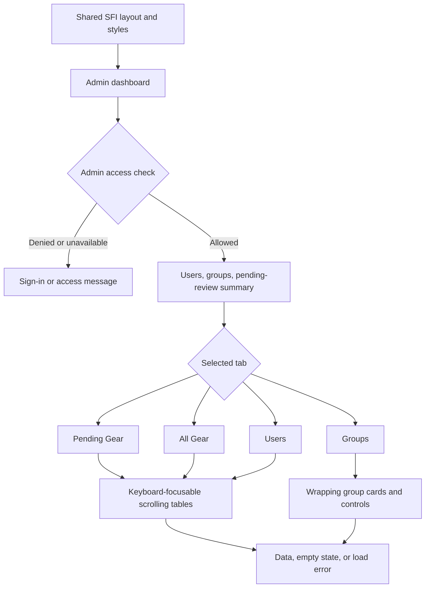

# Admin dashboard layout

Implements Frontend #2. `/admin/` uses `_layouts/sfi.html` for the shared navigation, footer, and `_includes/sfi/styles.html`. All dashboard styles now live in that shared stylesheet.

An authenticated administrator sees summary cards for total users, total groups, and pending gear reviews. Pending Gear, All Gear, Users, and Groups remain separate panels, preserving the existing gear-review workflow. Only the selected panel is visible. Arrow keys, Home, and End switch tabs; ARIA tab states follow the selection.

At phone widths, summary cards stack and spacing shrinks. Table containers scroll horizontally without widening the page. Group grids can shrink below 320px, and long names and descriptions wrap. A failed request displays an error and an unavailable count instead of falsely reporting zero records.

## Review checks

Check at 375px, 768px, and desktop widths with long usernames, group names, and gear names. Confirm that the document width does not exceed the viewport; tables may scroll inside their own regions. Switch every tab using mouse and keyboard. Confirm summary counts track the loaded data and refresh after group creation or gear review. Check empty data, a failed backend request, and a non-admin account.

Backend endpoint implementation is tracked separately in Backend #1 and Frontend #1. This layout does not replace backend authorization.
